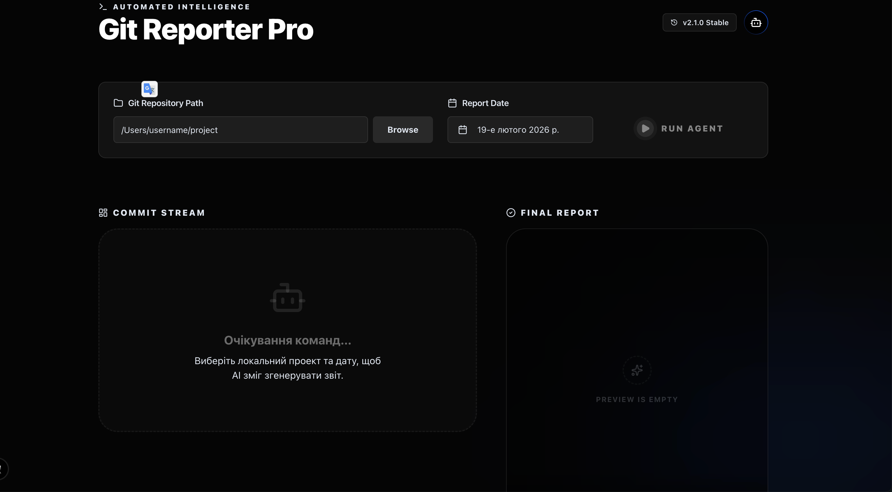

# 🚀 Git AI Reporter Pro (English)

A modern tool for automatically generating technical reports based on your Git commits using local AI (Ollama).



## ✨ Features

- **🤖 AI Analysis**: Uses Ollama (local) or Grok (xAI cloud) to distill the technical essence of your changes.
- **📅 Date-Based Reports**: Retrieve all commits for a specific day across all branches simultaneously.
- **⚖️ Duration Calculation**: Automatically calculates the total work time and formats it as hours and minutes.
- **🛡️ Security**: All keys and configurations are stored locally in `.env` files.
- **📱 Telegram Integration**: Send ready-to-go reports directly to your work chat with a single click.
- **🎨 Modern UI**: Glassmorphism design, animated gradients, and premium components based on Shadcn UI.

## 🛠 Tech Stack

- **Backend**: Python (FastAPI), GitPython, Ollama API.
- **Frontend**: Next.js 15, TypeScript, Tailwind CSS 4, Framer Motion, Lucide React, Shadcn/UI, Sonner.

## 🚀 Quick Start

### 1. Prerequisites
- [Ollama](https://ollama.com/) installed with the `llama3` model.
- Python 3.9+ and Node.js 18+.

#### Install Ollama

**macOS / Linux:**
```bash
curl -fsSL https://ollama.com/install.sh | sh
```

**macOS (alternative):** Download [Ollama.dmg](https://ollama.com/download/Ollama.dmg) and drag to Applications.

**Pull the llama3 model after installation:**
```bash
ollama pull llama3
```

**Verify Ollama is running** (it usually starts automatically; if not):
```bash
ollama serve
```

### 2. Environment Setup
Create a `.env` file in the `backend/` folder:
```env
TELEGRAM_TOKEN=your_token
TELEGRAM_CHAT_ID=your_id
OLLAMA_URL=http://localhost:11434/api/generate
OLLAMA_MODEL=llama3

# Optional: for Grok (xAI) - get API key at https://console.x.ai
# XAI_API_KEY=your_xai_key
# XAI_MODEL=grok-2
```

Create a `.env.local` file in the `frontend/` folder:
```env
NEXT_PUBLIC_API_URL=http://localhost:8000
```

### 3. Running the App
Simply run the magic script in the root directory:
```bash
chmod +x run.sh
./run.sh
```
This will automatically install dependencies for both backend and frontend, start both servers, and open the application in your browser on port **3001**.

## 📝 Usage
1. Provide the path to your local Git repository.
2. Select the report date.
3. Click **Run Agent** to fetch commits.
4. Analyze each commit individually or click **Згенерувати загальний звіт** (Generate Full Report) for a holistic daily summary.
5. Send the result to Telegram or download it as a text file.

---
# 🚀 Git AI Reporter Pro

Сучасний інструмент для автоматичного створення технічних звітів на основі ваших Git-комітів за допомогою локального ШІ (Ollama).

## ✨ Особливості

- **🤖 AI Аналіз**: Використовує Ollama (локально) або Grok (xAI хмара) для дистиляції технічної суті ваших змін.
- **📅 Звіти за Датою**: Отримуйте всі коміти за конкретний день з усіх гілок одночасно.
- **⚖️ Розрахунок часу**: Автоматично підсумовує витрачений час та виводить його у форматі годин та хвилин.

- **📱 Telegram Integration**: Відправляйте готові звіти прямо у ваш робочий чат одним кліком.
- **🎨 Modern UI**: Скляний дизайн, анімовані градієнти та преміальні компоненти на базі Shadcn UI.

## 🛠 Технологічний стек

- **Backend**: Python (FastAPI), GitPython, Ollama API.
- **Frontend**: Next.js 15, TypeScript, Tailwind CSS 4, Framer Motion, Lucide React, Shadcn/UI, Sonner.

## 🚀 Швидкий старт

### 1. Попередні вимоги
- Встановлений [Ollama](https://ollama.com/) з моделлю `llama3`.
- Python 3.9+ та Node.js 18+.

#### Встановлення Ollama

**macOS / Linux:**
```bash
curl -fsSL https://ollama.com/install.sh | sh
```

**macOS (альтернатива):** Завантажте [Ollama.dmg](https://ollama.com/download/Ollama.dmg) і перетягніть у Programs.

**Завантажте модель llama3 після встановлення:**
```bash
ollama pull llama3
```

**Перевірте, що Ollama працює** (зазвичай запускається автоматично; якщо ні):
```bash
ollama serve
```

### 2. Налаштування оточення
Створіть `.env` файл у папці `backend/`:
```env
TELEGRAM_TOKEN=ваш_токен
TELEGRAM_CHAT_ID=ваш_id
OLLAMA_URL=http://localhost:11434/api/generate
OLLAMA_MODEL=llama3

# Опційно: для Grok (xAI) - ключ на https://console.x.ai
# XAI_API_KEY=ваш_xai_ключ
# XAI_MODEL=grok-2
```

Створіть `.env.local` файл у папці `frontend/`:
```env
NEXT_PUBLIC_API_URL=http://localhost:8000
```

### 3. Запуск
Просто запустіть магічний скрипт у корені проекту:
```bash
chmod +x run.sh
./run.sh
```
Це автоматично встановить залежності для бекенду та фронтенду, запустить обидва сервери та відкриє програму в браузері на порту **3001**.

## 📝 Як користуватися
1. Виберіть шлях до вашого локального Git-репозиторію.
2. Оберіть дату, за яку потрібно зібрати звіт.
3. Натисніть **Run Agent** для завантаження комітів.
4. Аналізуйте кожен коміт окремо або натисніть **Згенерувати загальний звіт** для отримання цілісного підсумку за день.
5. Надішліть результат у Telegram або завантажте як текстовий файл.

